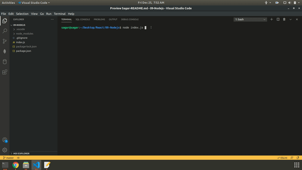

# Unit 09 Node.js and ES6+ Homework: Good README Generator

- [View video](https://drive.google.com/file/d/1zLQcDMQ3TdkzSGZqRDkTvq5vyiuxKduK/view?usp=sharing)

## Example

    The React-README.md file is the one of the example output of the cli app.
